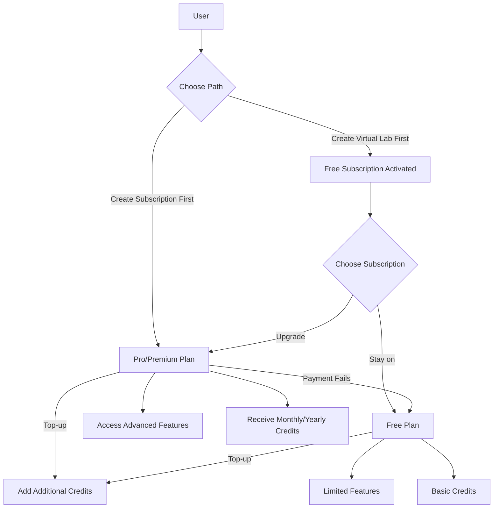
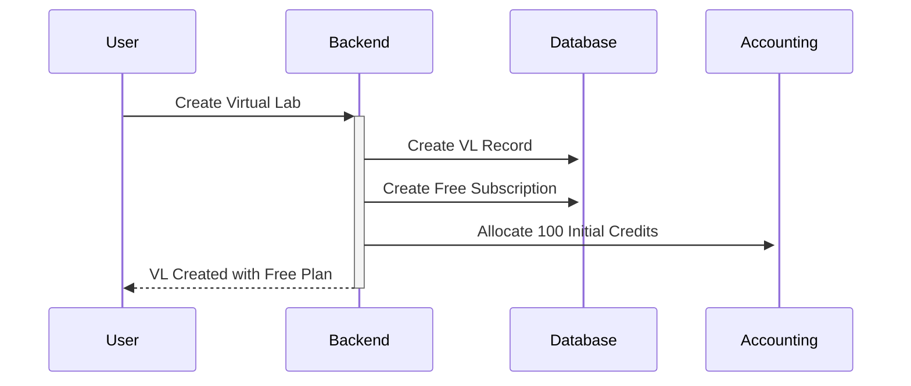
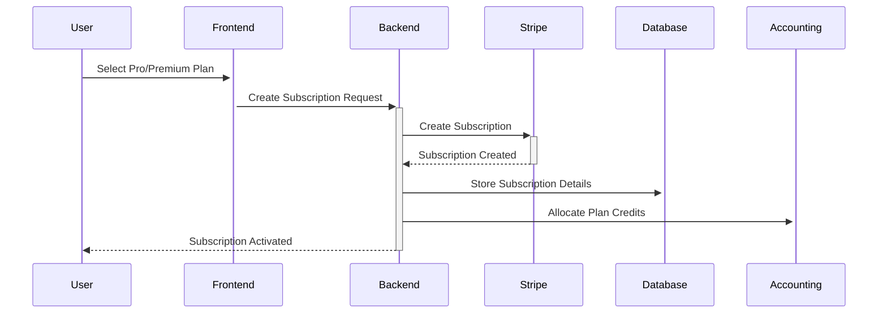
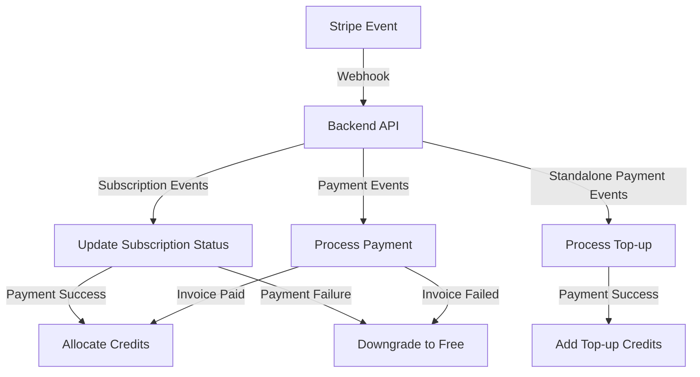
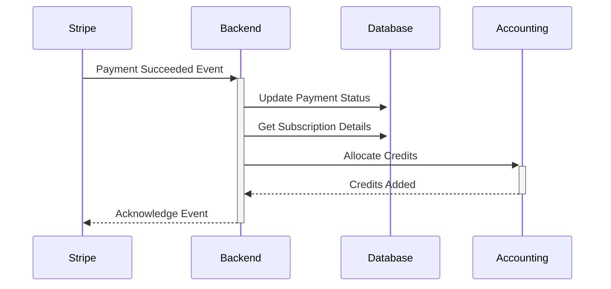
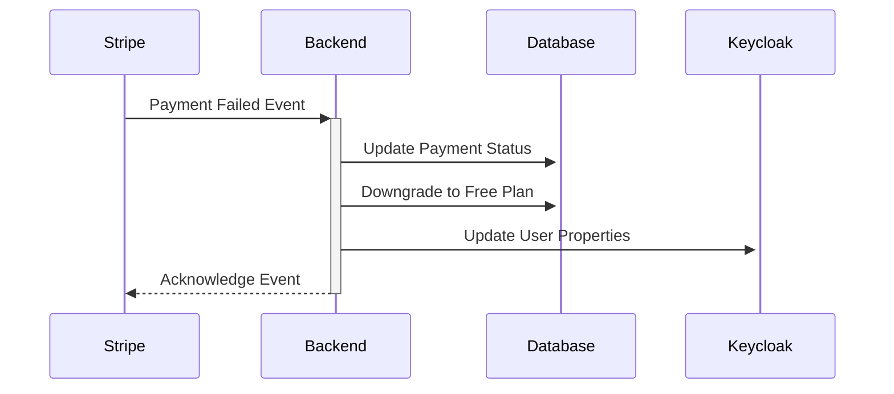
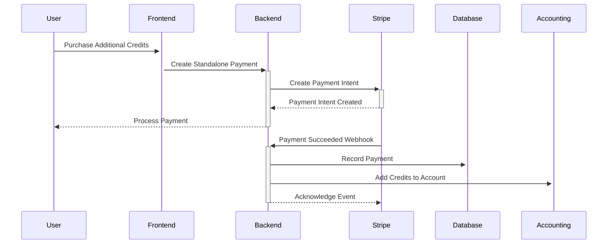
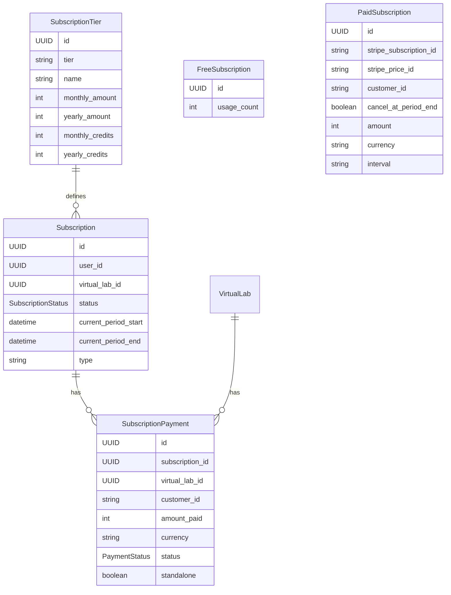
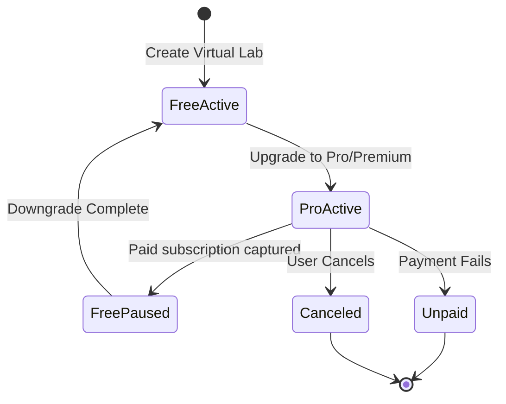

# Virtual Labs Subscription System

## Overview

The Virtual Labs platform offers a tiered subscription model designed to accommodate different user needs and usage patterns. This document outlines the subscription system's architecture, functionality, and workflows.



## User Onboarding Paths

Users can join the Virtual Labs platform through two different paths:

### Path 1: Create Virtual Lab First
1. User creates a virtual lab
2. Free subscription is automatically activated
3. User receives 100 initial credits
4. User can later upgrade to Pro/Premium plans

### Path 2: Create Subscription First
1. User selects and purchases a Pro/Premium subscription
2. User receives subscription benefits immediately
3. User can create virtual labs with enhanced features
4. User receives monthly/yearly credits based on their plan
5. User also receives an additional 100 free credits as a welcome bonus


## Subscription Tiers

The system offers three subscription tiers:

| Tier | Features | Monthly Credits | Yearly Credits |
|------|----------|----------------|----------------|
| Free | Basic functionality | 100 credits (one-time) | N/A |
| Pro | Advanced features | 50 credits/month | 650 credits/year |
| Premium | All features | Varies by plan | Varies by plan |

## Key Concepts

### Credits System

Credits are the platform's internal currency used for various operations:

> **Note:** All users, regardless of their subscription path, receive 100 free credits as a welcome bonus. This is in addition to any monthly or yearly credits they receive from their Pro/Premium subscription.

- **Pro/Premium Plans**: Users receive monthly or yearly credits based on their subscription type
- **Top-ups**: Users can purchase additional credits at any time as standalone payments
- **Conversion Rate**: Money paid for subscriptions or top-ups is converted to credits (at a rate of 0.05 credits per monetary unit)
- **Cumulative**: Credits accumulate over time and don't expire

### Payment Processing

The platform integrates with Stripe for payment processing:

- **Subscription Payments**: Auto-billed monthly or yearly
- **Immediate Processing**: No trial periods or delays for subscription payments
- **Standalone Payments**: One-time payments for credit top-ups
- **Payment Failure Handling**: Automatic downgrade to Free plan if subscription payment fails

## Subscription Lifecycle

### 1. Virtual Lab Creation & Free Tier

When a user first creates a virtual lab, they're automatically enrolled in the Free subscription:



**Code Sample:**
```python
# Create free subscription for new lab
if not await subscription_repo.get_free_subscription_by_user_id(
    user_id=owner_id
):
    await subscription_repo.create_free_subscription(
        user_id=owner_id, virtual_lab_id=UUID(str(db_lab.id))
    )

# Initial credit allocation
welcome_bonus_credits = (
    settings.WELCOME_BONUS_CREDITS
    if settings.ENABLE_WELCOME_BONUS
    else Decimal(0)
)
```

### 2. Upgrading to Pro/Premium

Users can upgrade from the Free plan to a Pro or Premium subscription:



**Code Sample:**
```python
stripe_subscription = await stripe_service.create_subscription(
    customer_id=customer_id,
    price_id=price_id,
    payment_method_id=payload.payment_method_id,
    metadata={
        "user_id": str(user_id),
        "email": user["email"],
        "name": user["full_name"],
    },
    discount_id=discount_id,
)
```

### 3. Webhook-Based Payment Processing

Stripe webhooks are crucial for managing subscription state and payment processing:



The webhook system handles various events:

#### Subscription Events
- `customer.subscription.created`
- `customer.subscription.updated`
- `customer.subscription.deleted`

#### Payment Events
- `invoice.payment_succeeded`
- `invoice.payment_failed`

#### Standalone Payment Events
- `payment_intent.succeeded`
- `payment_intent.payment_failed`
- `payment_intent.canceled`

**Code Sample:**
```python
async def handle_webhook_event(
    self, event_json: stripe.Event, db_session: AsyncSession
) -> Dict[str, Any]:
    event_type = event_json.get("type")
    event_id = event_json.get("id")
    metadata = event_json.get("data", {}).get("object", {}).get("metadata", {})

    if event_type in self.subscription_update_events:
        return await self._handle_subscription_event(event_json, db_session)
    if metadata.get("standalone") and (
        event_type in self.standalone_payment_events
    ):
        return await self._handle_standalone_payment_event(
            event_json, db_session
        )
    elif event_type in self.payment_update_events:
        return await self._handle_payment_event(event_json, db_session)
```

### 4. Credit Allocation

When a payment succeeds, credits are allocated to the user's account:



**Code Sample:**
```python
# For subscription credits
subscription_credit_amount = (
    subscription_tier.yearly_credits
    if subscription_tier.stripe_yearly_price_id == price_id
    else subscription_tier.monthly_credits
)

await accounting_service.top_up_virtual_lab_budget(
    virtual_lab_id,
    float(subscription_credit_amount),
)

# For standalone payments
credits_amount = await self.credit_converter.currency_to_credits(
    amount,
    payment.currency,
)

if accounting_service.is_enabled:
    await accounting_service.top_up_virtual_lab_budget(
        UUID(virtual_lab_id), float(credits_amount)
    )
```

### 5. Handling Payment Failures

If a subscription payment fails, the system automatically downgrades the user to the Free plan:



**Code Sample:**
```python
if (
    event_type == "customer.subscription.deleted"
    or subscription.status != "active"
):
    try:
        await self.kc_user.update_user_custom_properties(
            user_id=subscription.user_id,
            properties=[
                ("plan", SubscriptionTierEnum.FREE, "multiple"),
            ],
        )
    except Exception as e:
        logger.warning(
            f"Failed to update user custom properties in Keycloak: {str(e)}"
        )
    # Continue with subscription downgrade even if Keycloak update fails
    await self.subscription_repository.downgrade_to_free(
        user_id=subscription.user_id
    )
```

### 6. Standalone Top-up Payments

Users can purchase additional credits at any time, regardless of their subscription plan:



**Code Sample:**
```python
payment_intent = await stripe_service.create_payment_intent(
    amount=payload.amount,
    currency=payload.currency,
    customer_id=customer_id,
    virtual_lab_id=payload.virtual_lab_id,
    payment_method_id=payload.payment_method_id,
    metadata={
        "user_id": str(user_id),
        "virtual_lab_id": str(payload.virtual_lab_id),
        "subscription_id": str(subscription.id),
        "standalone": "true",
    },
)
```

## Database Structure

The system uses several interconnected database models to track subscriptions and payments:

- **Subscription**: Base subscription model with common fields
  - **FreeSubscription**: Extends Subscription for free tier users
  - **PaidSubscription**: Extends Subscription for Pro/Premium tier users
- **SubscriptionPayment**: Tracks individual payments for subscriptions or standalone top-ups
- **SubscriptionTier**: Defines available plans and their features
- **StripeUser**: Links platform users to their Stripe customer IDs



## Subscription States

Due to the nature of our subscription flow (where payment is required at the time of subscription creation), some subscription states are not used in practice. The most commonly used states are:

- **Active**: Subscription is in good standing with successful payments
- **Canceled**: Subscription has been explicitly canceled by the user
- **Unpaid**: Payment failed and subscription is no longer active
- **Paused**: Free subscription is temporarily paused when user upgrades to Pro/Premium (not manually pausable)

> **Note:** The Paused state is only used internally when upgrading from Free to Pro/Premium. The Free subscription is paused until the user downgrades back to Free (either by canceling or due to payment failure). Users cannot manually pause their subscriptions.

The following states are not typically used in our system:
- **Past Due**: Not used as we require immediate payment
- **Incomplete**: Not used as we require payment at creation
- **Incomplete Expired**: Not used as we require payment at creation



## Important Considerations

### Webhook Security

Webhooks are authenticated using Stripe signatures to ensure only legitimate events are processed:

```python
event = await stripe_service.construct_event(body, stripe_signature)

if not event:
    raise HTTPException(
        status_code=HTTPStatus.BAD_REQUEST,
        detail="Invalid Stripe webhook signature",
    )
```

### Error Handling

The system implements comprehensive error handling to ensure robustness:

- Database transaction management
- Exception catching and logging
- Graceful fallback mechanisms
- Status tracking for all payment operations

### Subscription Synchronization

The system maintains consistency between Stripe's subscription data and the internal database:

- Webhook events update internal state
- Audit trails for all subscription changes

## User Experience Flows

### New User Flow

1. User creates a virtual lab
2. Free subscription is automatically created
3. 100 initial credits are allocated
4. User can immediately use basic features
5. User is prompted to upgrade for advanced features

### Upgrade Flow

1. User selects a Pro/Premium plan
2. User provides payment details
3. Subscription is created in Stripe
4. Initial payment is processed
5. Plan credits are allocated
6. User gains access to advanced features

### Payment Renewal Flow

1. Stripe attempts automatic renewal billing
2. On success, subscription continues and new credits are allocated
3. On failure, user is downgraded to Free plan
4. User is notified about payment failure and downgrade

### Credit Top-up Flow

1. User selects amount to top up
2. User confirms payment method
3. Payment is processed immediately
4. On success, credits are added to account
5. User receives confirmation of added credits