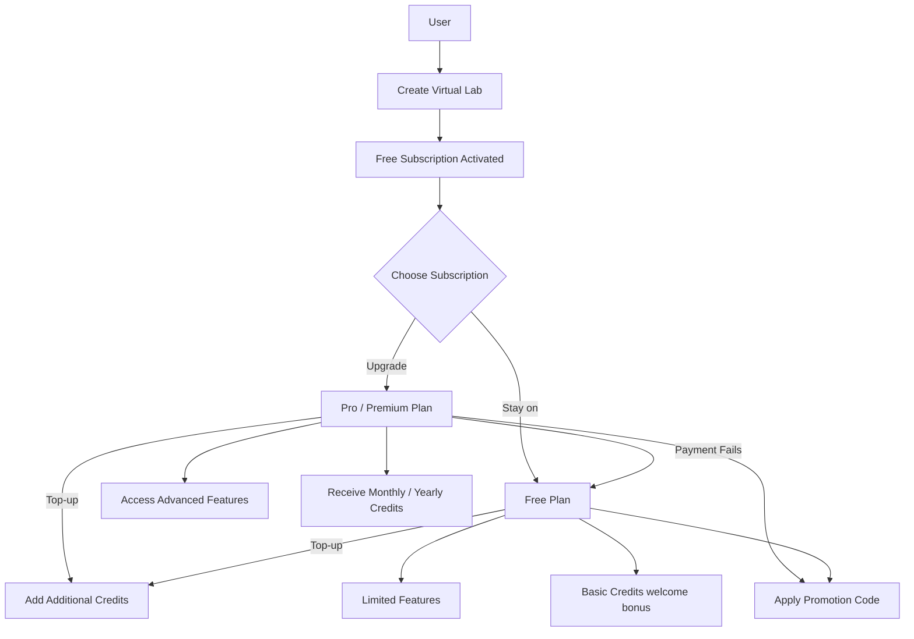
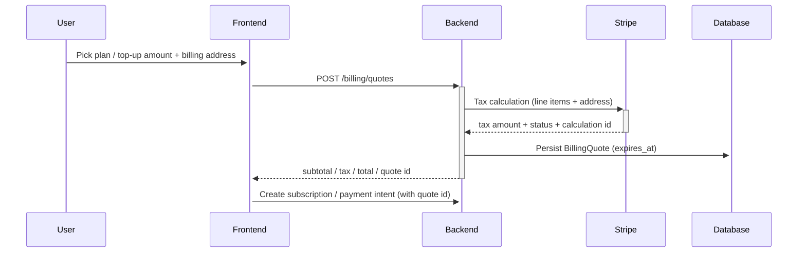
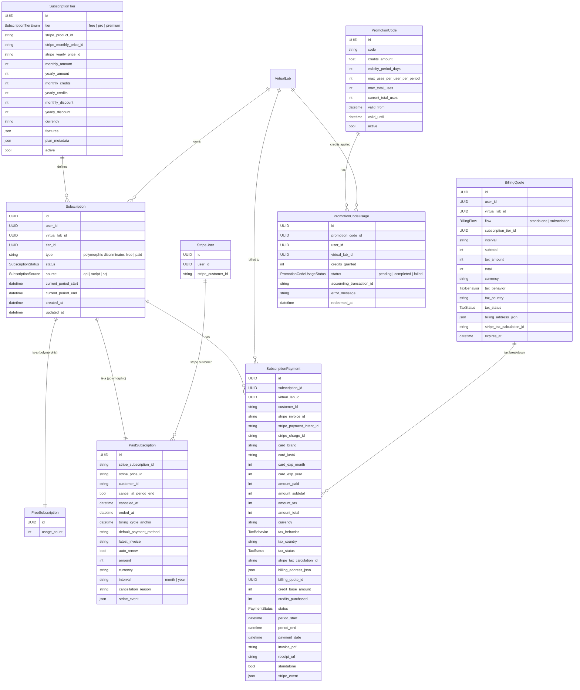
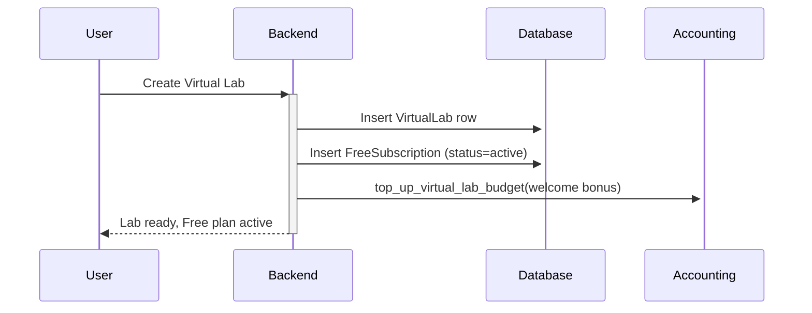
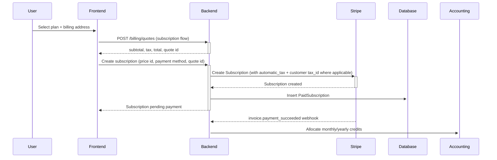
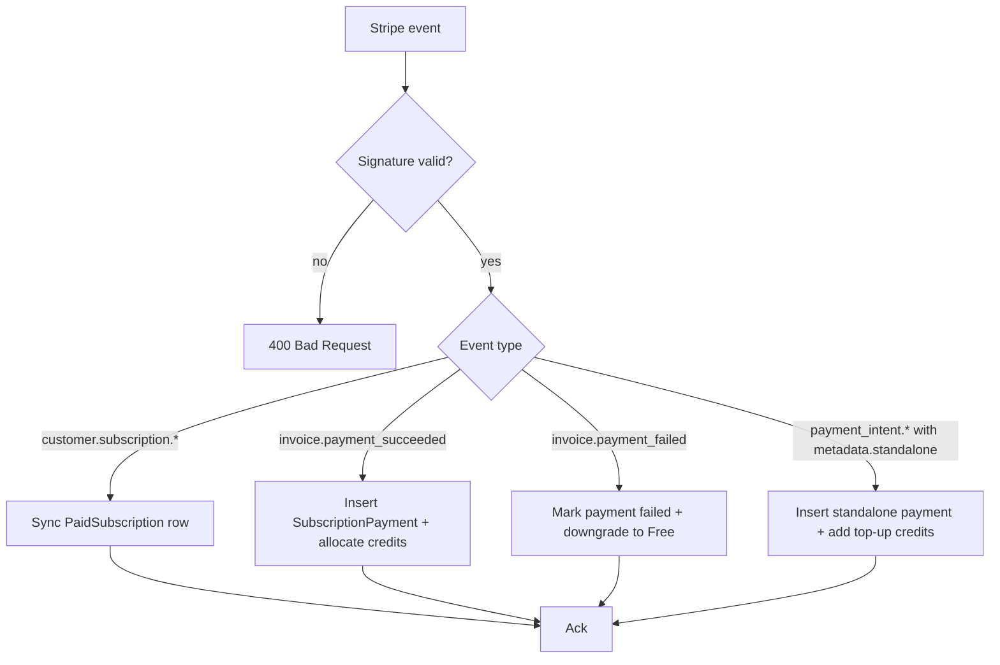
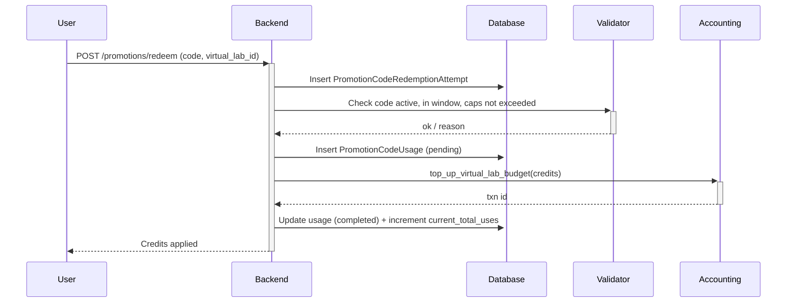
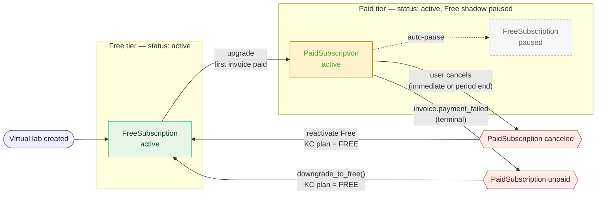

# Virtual Labs Subscription System

## Overview

The Virtual Labs platform offers a tiered subscription model with first-class **tax-aware billing** (Stripe Tax / Swiss VAT) and **credit-based** usage accounting. This document describes the current data model, lifecycle, Stripe webhook contract, tax-quote flow, and promotion-code flow.


```mermaid
graph TD
    A[User] --> C[Create Virtual Lab]
    C --> F[Free Subscription Activated]
    F --> E{Choose Subscription}
    E -->|Upgrade| D[Pro / Premium Plan]
    E -->|Stay on| F2[Free Plan]
    D --> G[Access Advanced Features]
    D --> H[Receive Monthly / Yearly Credits]
    F2 --> I[Limited Features]
    F2 --> J[Basic Credits welcome bonus]
    D -->|Top-up| K[Add Additional Credits]
    F2 -->|Top-up| K
    D -->|Payment Fails| F2
    D --> Q[Apply Promotion Code]
    F2 --> Q
```

> **A virtual lab is a prerequisite for any subscription.** Pro / Premium plans cannot be created standalone — the user must first create a virtual lab (which auto-activates the Free tier), then upgrade it. Top-ups and promotion codes are likewise scoped to an existing virtual lab.

---

## Subscription tiers

Tiers are defined in the `subscription_tier` table and seeded via the `populate-tiers` script (see [scripts/populate_subscription_tiers.py](scripts/populate_subscription_tiers.py)).

| Tier    | Stripe? | Monthly credits | Yearly credits | Notes                                                  |
| ------- | ------- | --------------- | -------------- | ------------------------------------------------------ |
| Free    | No      | 100 (one-time welcome bonus, gated by `ENABLE_WELCOME_BONUS`) | N/A | Auto-activated on first virtual lab creation           |
| Pro     | Yes     | Configured per tier row                                       | Configured per tier row | `stripe_monthly_price_id` / `stripe_yearly_price_id`   |
| Premium | Yes     | Configured per tier row                                       | Configured per tier row | Higher credit allotment, full feature set              |

Each tier carries `stripe_product_id`, monthly/yearly price IDs and amounts, discounts, currency (defaults to `chf`), feature/metadata JSON, and credit allotments.

---

## Credits & currency

- **Internal currency:** credits. All accounting and quota enforcement work in credits, not money.
- **Conversion:** `CreditConverter` ([virtual_labs/services/credit_converter.py](virtual_labs/services/credit_converter.py)) translates between currency and credits using the `credit_exchange_rate` table (per-currency rates). Subscription tier currency defaults to **CHF**.
- **Accounting integration:** credits are pushed to the OBP accounting service via `accounting_service.top_up_virtual_lab_budget(...)`.
- **Welcome bonus:** `WELCOME_BONUS_CREDITS` (gated by `ENABLE_WELCOME_BONUS`) is added on first lab creation, regardless of paid plan.
- **Top-ups:** users can buy additional credits at any time as standalone payments.

---

## Tax-aware billing (Stripe Tax)

The platform supports **tax-inclusive pricing** and **VAT computation** via Stripe Tax. Swiss VAT (CH) is the first enforced jurisdiction; the system is structured to support more countries by configuration.

### Settings

Defined in `.env.development` / settings:

| Setting                                | Purpose                                                                 |
| -------------------------------------- | ----------------------------------------------------------------------- |
| `STRIPE_API_VERSION`                   | Stripe API version pinned for the integration                           |
| `STRIPE_CREDIT_TAX_CODE`               | Stripe Tax product code applied to credit purchases                     |
| `BILLING_TAX_ENABLED`                  | Master switch for tax calculation                                       |
| `BILLING_TAX_ENABLED_COUNTRIES`        | Comma-separated ISO-3166 codes where tax is computed (e.g. `CH`)        |
| `BILLING_TAX_BEHAVIOR`                 | `exclusive` (tax added on top of subtotal) — see `TaxBehavior` enum     |
| `BILLING_TAX_MISSING_COUNTRY_MODE`     | `block` rejects requests without a billing country; alternative: allow  |

### Domain model

[virtual_labs/domain/billing.py](virtual_labs/domain/billing.py):

- `BillingFlow` — `standalone` (credit top-up) or `subscription`.
- `TaxBehavior` — `exclusive`.
- `TaxStatus` — `calculated`, `not_applicable`, `pending`, `failed`.
- `BillingAddress` — ISO-3166 country code required (2-letter, uppercased automatically).

### Quote flow

The frontend obtains a **billing quote** *before* checkout so the user sees the correct VAT-inclusive total:


```mermaid
sequenceDiagram
    User->>+Frontend: Pick plan / top-up amount + billing address
    Frontend->>+Backend: POST /billing/quotes
    Backend->>+Stripe: Tax calculation (line items + address)
    Stripe-->>-Backend: tax amount + status + calculation id
    Backend->>+Database: Persist BillingQuote (expires_at)
    Backend-->>-Frontend: subtotal / tax / total / quote id
    Frontend->>+Backend: Create subscription / payment intent (with quote id)
```

The `billing_quote` table stores `flow`, optional `subscription_tier_id` + `interval` (for subscription quotes) or `credits` (for standalone), `subtotal`, `tax_amount`, `total`, `currency`, `tax_behavior`, `tax_country`, `tax_status`, full `billing_address_json`, `stripe_tax_calculation_id`, and `expires_at`. Quotes are short-lived and reference-able by payment-intent / subscription creation.

### Endpoints

- `POST /billing/quotes` — create a tax-aware quote (subscription or standalone).
- `POST /billing/credit-conversions` — convert credits ↔ currency at the active exchange rate.

See [virtual_labs/routes/billing.py](virtual_labs/routes/billing.py).

---

## Database structure


```mermaid
erDiagram
    Subscription ||--o{ SubscriptionPayment : has
    Subscription ||--|| FreeSubscription : "is-a (polymorphic)"
    Subscription ||--|| PaidSubscription : "is-a (polymorphic)"
    SubscriptionTier ||--o{ Subscription : defines
    VirtualLab ||--o{ Subscription : owns
    VirtualLab ||--o{ SubscriptionPayment : "billed to"
    StripeUser ||--o{ PaidSubscription : "stripe customer"
    BillingQuote ||--o{ SubscriptionPayment : "tax breakdown"
    PromotionCode ||--o{ PromotionCodeUsage : has
    VirtualLab ||--o{ PromotionCodeUsage : "credits applied"

    Subscription {
        UUID id
        UUID user_id
        UUID virtual_lab_id
        UUID tier_id
        string type "polymorphic discriminator: free | paid"
        SubscriptionStatus status
        SubscriptionSource source "api | script | sql"
        datetime current_period_start
        datetime current_period_end
        datetime created_at
        datetime updated_at
    }

    FreeSubscription {
        UUID id
        int usage_count
    }

    PaidSubscription {
        UUID id
        string stripe_subscription_id
        string stripe_price_id
        string customer_id
        bool cancel_at_period_end
        datetime canceled_at
        datetime ended_at
        datetime billing_cycle_anchor
        string default_payment_method
        string latest_invoice
        bool auto_renew
        int amount
        string currency
        string interval "month | year"
        string cancellation_reason
        json stripe_event
    }

    SubscriptionPayment {
        UUID id
        UUID subscription_id
        UUID virtual_lab_id
        string customer_id
        string stripe_invoice_id
        string stripe_payment_intent_id
        string stripe_charge_id
        string card_brand
        string card_last4
        int card_exp_month
        int card_exp_year
        int amount_paid
        int amount_subtotal
        int amount_tax
        int amount_total
        string currency
        TaxBehavior tax_behavior
        string tax_country
        TaxStatus tax_status
        string stripe_tax_calculation_id
        json billing_address_json
        UUID billing_quote_id
        int credit_base_amount
        int credits_purchased
        PaymentStatus status
        datetime period_start
        datetime period_end
        datetime payment_date
        string invoice_pdf
        string receipt_url
        bool standalone
        json stripe_event
    }

    SubscriptionTier {
        UUID id
        SubscriptionTierEnum tier "free | pro | premium"
        string stripe_product_id
        string stripe_monthly_price_id
        string stripe_yearly_price_id
        int monthly_amount
        int yearly_amount
        int monthly_credits
        int yearly_credits
        int monthly_discount
        int yearly_discount
        string currency
        json features
        json plan_metadata
        bool active
    }

    BillingQuote {
        UUID id
        UUID user_id
        UUID virtual_lab_id
        BillingFlow flow "standalone | subscription"
        UUID subscription_tier_id
        string interval
        int subtotal
        int tax_amount
        int total
        string currency
        TaxBehavior tax_behavior
        string tax_country
        TaxStatus tax_status
        json billing_address_json
        string stripe_tax_calculation_id
        datetime expires_at
    }

    StripeUser {
        UUID id
        UUID user_id
        string stripe_customer_id
    }

    PromotionCode {
        UUID id
        string code
        float credits_amount
        int validity_period_days
        int max_uses_per_user_per_period
        int max_total_uses
        int current_total_uses
        datetime valid_from
        datetime valid_until
        bool active
    }

    PromotionCodeUsage {
        UUID id
        UUID promotion_code_id
        UUID user_id
        UUID virtual_lab_id
        int credits_granted
        PromotionCodeUsageStatus status "pending | completed | failed"
        string accounting_transaction_id
        string error_message
        datetime redeemed_at
    }
```

> Authoritative source: [virtual_labs/infrastructure/db/models.py](virtual_labs/infrastructure/db/models.py). All schema changes go through Alembic — see [alembic/versions](alembic/versions).

### Notable constraints

- `SubscriptionPayment.standalone = true` implies `virtual_lab_id IS NOT NULL` (check constraint).
- `SubscriptionPayment` carries the full **tax breakdown** (`amount_subtotal`, `amount_tax`, `amount_total`) and an optional `billing_quote_id` linking back to the quote used at checkout.
- `PaidSubscription.stripe_subscription_id` is unique; `Subscription` uses polymorphic joined-table inheritance (`type` discriminator).
- `Subscription.source` records where the row originated (`api`, `script`, `sql`) — useful for migrations and bulk operations.

---

## Subscription lifecycle

### 1. Virtual lab creation → Free tier


```mermaid
sequenceDiagram
    User->>+Backend: Create Virtual Lab
    Backend->>+Database: Insert VirtualLab row
    Backend->>+Database: Insert FreeSubscription (status=active)
    Backend->>+Accounting: top_up_virtual_lab_budget(welcome bonus)
    Backend-->>-User: Lab ready, Free plan active
```

### 2. Upgrade to Pro / Premium


```mermaid
sequenceDiagram
    User->>+Frontend: Select plan + billing address
    Frontend->>+Backend: POST /billing/quotes (subscription flow)
    Backend-->>-Frontend: subtotal, tax, total, quote id
    Frontend->>+Backend: Create subscription (price id, payment method, quote id)
    Backend->>+Stripe: Create Subscription (with automatic_tax + customer tax_id where applicable)
    Stripe-->>-Backend: Subscription created
    Backend->>+Database: Insert PaidSubscription
    Backend-->>-Frontend: Subscription pending payment
    Stripe-->>+Backend: invoice.payment_succeeded webhook
    Backend->>+Accounting: Allocate monthly/yearly credits
```

### 3. Renewal / cancellation

- Renewal happens automatically via Stripe; the platform mirrors state through `customer.subscription.updated` and the `invoice.payment_succeeded` event.
- Cancellation can be **at period end** (`cancel_at_period_end = true`) or **immediate**, tracked via `canceled_at` / `ended_at`. See [virtual_labs/usecases/subscription/cancel_subscription.py](virtual_labs/usecases/subscription/cancel_subscription.py).

### 4. Payment failure → downgrade

On `invoice.payment_failed` (or a terminal `customer.subscription.deleted` / non-active status), the system:

1. Marks the payment as `failed` in `subscription_payment`.
2. Calls `subscription_repository.downgrade_to_free(user_id=…)`.
3. Best-effort updates the user's Keycloak custom property `plan = FREE`.

Keycloak update failures do **not** block the downgrade (logged as warning).

---

## Stripe webhooks

Webhook signatures are verified on every request before dispatch:

```python
event = await stripe_service.construct_event(body, stripe_signature)
if not event:
    raise HTTPException(status_code=HTTPStatus.BAD_REQUEST, detail="Invalid Stripe webhook signature")
```

The dispatcher lives in [virtual_labs/infrastructure/stripe/webhook.py](virtual_labs/infrastructure/stripe/webhook.py) and the event constants in [virtual_labs/infrastructure/stripe/helpers.py](virtual_labs/infrastructure/stripe/helpers.py).

### Handled events

**Subscription events** (`SUBSCRIPTION_UPDATE_EVENTS` = upsert ∪ deleted):

- `customer.subscription.created`
- `customer.subscription.updated`
- `customer.subscription.pending_update_applied`
- `customer.subscription.pending_update_expired`
- `customer.subscription.deleted`

**Invoice payment events** (`INVOICE_PAYMENT_EVENTS`):

- `invoice.payment_succeeded`
- `invoice.payment_failed`

**Standalone (top-up) payment events** (`STANDALONE_PAYMENT_EVENTS`):

- `payment_intent.succeeded`
- `payment_intent.payment_failed`
- `payment_intent.canceled`

Standalone events are routed by checking `metadata.standalone == "true"` on the payment intent — set when the intent is created for credit top-ups.


```mermaid
graph TD
    A[Stripe event] --> B{Signature valid?}
    B -- no --> X[400 Bad Request]
    B -- yes --> C{Event type}
    C -->|customer.subscription.*| D[Sync PaidSubscription row]
    C -->|invoice.payment_succeeded| E[Insert SubscriptionPayment + allocate credits]
    C -->|invoice.payment_failed| F[Mark payment failed + downgrade to Free]
    C -->|payment_intent.* with metadata.standalone| G[Insert standalone payment + add top-up credits]
    D --> Z[Ack]
    E --> Z
    F --> Z
    G --> Z
```

> **v1 → v2 events:** the helper `resource_id_from_event` is the single switchover point if/when Stripe is migrated to v2 thin events. Handlers consume the resource id only.

---

## Promotion codes

Users can redeem promotion codes for credits, gated by per-user / per-period and total-use caps.

### Tables

- `promotion_code` — code definition, `credits_amount`, `validity_period_days`, `max_uses_per_user_per_period`, `max_total_uses`, `valid_from` / `valid_until`, `active` flag.
- `promotion_code_usage` — successful (or in-flight) redemptions with `status` ∈ {`pending`, `completed`, `failed`}, optional `accounting_transaction_id`, error message.
- `promotion_code_redemption_attempt` — analytics row for every attempt (success or failure, with `failure_reason`).

Validation rules (DB-enforced check constraints): positive credits, positive caps, `valid_until > valid_from`.

### Flow


```mermaid
sequenceDiagram
    User->>+Backend: POST /promotions/redeem (code, virtual_lab_id)
    Backend->>+Database: Insert PromotionCodeRedemptionAttempt
    Backend->>+Validator: Check code active, in window, caps not exceeded
    Validator-->>-Backend: ok / reason
    Backend->>+Database: Insert PromotionCodeUsage (pending)
    Backend->>+Accounting: top_up_virtual_lab_budget(credits)
    Accounting-->>-Backend: txn id
    Backend->>+Database: Update usage (completed) + increment current_total_uses
    Backend-->>-User: Credits applied
```

Admin endpoints (under the admin router in [virtual_labs/routes/promotions.py](virtual_labs/routes/promotions.py)) cover code creation, listing, activation, and audit. Bulk management is available via `uv run manage-coupons` ([scripts/manage_stripe_coupons.py](scripts/manage_stripe_coupons.py)).

---

## Subscription statuses

The full Stripe status enum is mirrored in `SubscriptionStatus`:

| Status                | Used? | Meaning                                                   |
| --------------------- | ----- | --------------------------------------------------------- |
| `active`              | yes   | Good standing, payments succeeding                        |
| `canceled`            | yes   | Cancelled by user or at period end                        |
| `unpaid`              | yes   | Terminal state after failed invoice; downgraded to Free   |
| `paused`              | yes   | Internal-only — Free sub paused while a paid sub is active|
| `past_due`            | rare  | Not normally used; we require immediate payment           |
| `incomplete`          | rare  | Not used — checkout requires successful payment           |
| `incomplete_expired`  | rare  | Not used                                                  |

**Two states the user can be in at any moment:**

| Effective tier | Free row     | Paid row     |
| -------------- | ------------ | ------------ |
| **Free**       | `active`     | — (or `canceled` / `unpaid`) |
| **Paid**       | `paused`     | `active`     |

The Free row is created with the virtual lab and **never deleted**: it acts as a fallback that is paused while a paid plan is active and re-activated on downgrade.


```mermaid
flowchart LR
    Start([Virtual lab created]):::entry --> Free

    subgraph Free_box [ Free tier — status: active ]
        Free[FreeSubscription<br/>active]:::free
    end

    subgraph Paid_box [ Paid tier — status: active, Free shadow paused ]
        Paid[PaidSubscription<br/>active]:::paid
        FreeShadow[FreeSubscription<br/>paused]:::shadow
    end

    Free -- "upgrade<br/>first invoice paid" --> Paid
    Paid -. auto-pause .-> FreeShadow

    Paid -- "user cancels<br/>(immediate or period end)" --> Canceled{{PaidSubscription canceled}}:::term
    Paid -- "invoice.payment_failed<br/>(terminal)" --> Unpaid{{PaidSubscription unpaid}}:::term

    Canceled -- "reactivate Free<br/>KC plan = FREE" --> Free
    Unpaid -- "downgrade_to_free()<br/>KC plan = FREE" --> Free

    classDef entry  fill:#eef,stroke:#557,color:#223
    classDef free   fill:#e7f5e7,stroke:#3a7,color:#143
    classDef paid   fill:#fff2cc,stroke:#b58900,color:#5a3
    classDef shadow fill:#f6f6f6,stroke:#aaa,color:#666,stroke-dasharray: 4 3
    classDef term   fill:#fdecea,stroke:#c0392b,color:#5a1a14
```

**Transitions in detail**

| From | To   | Trigger                                                                   | Side effects                                                                 |
| ---- | ---- | ------------------------------------------------------------------------- | ---------------------------------------------------------------------------- |
| —    | Free | `POST /virtual-labs` (lab created)                                        | Insert `FreeSubscription` (active), allocate welcome bonus                   |
| Free | Paid | Successful checkout — `invoice.payment_succeeded` for the new sub         | Insert `PaidSubscription` (active), pause Free row, allocate plan credits    |
| Paid | Free | User cancels — immediate or at period end (`customer.subscription.deleted`) | Paid row → `canceled`, Free row → `active`, KC `plan = FREE`               |
| Paid | Free | Stripe payment fails — `invoice.payment_failed` (terminal)                | Paid row → `unpaid`, Free row → `active`, KC `plan = FREE`                   |

In-state events that **don't** change tier: renewals (`invoice.payment_succeeded` on an existing sub), top-ups (standalone payment intents), and promotion-code redemptions — they only allocate credits.

---

## Operational notes

- **Migrations:** all subscription / billing / tax / promotion tables are managed by Alembic — see [alembic/versions](alembic/versions). The one-off `migrate-tax-billing` script ([scripts/migrate_to_tax_billing.py](scripts/migrate_to_tax_billing.py)) backfills tax fields on legacy `subscription_payment` rows during the rollout.
- **Audit trail:** `SubscriptionPayment.stripe_event` and `PaidSubscription.stripe_event` retain the raw Stripe payload of the last event applied, for forensic debugging.
- **Idempotency:** webhook handlers are designed to be re-runnable — they look up subscriptions by `stripe_subscription_id` and payments by `stripe_invoice_id` / `stripe_payment_intent_id`.
- **Keycloak sync:** plan changes mirror to the user's KC custom properties (`plan` attribute). Failures are tolerated and logged.
- **Local testing:** the Stripe CLI container in `docker-compose.yml` forwards webhook events to the local API. Test cards are documented in the Stripe docs; for Setup Intents see the README "Billing / Stripe testing" section.
